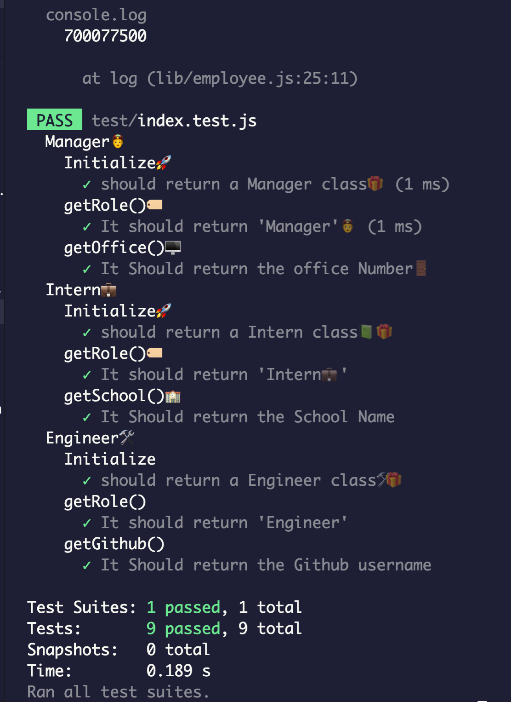

# TeamProfileBuilder🏗👷‍♀️

## Quickly build your team straight from the command line💻!  

## Description  🔖

I set out to create a command line application that would assit in the creation and management of team members. I wanted to make an easy to use and stylish application.  In building this app, I discovered better ways to implament ideas and refactor my code to be simplier and easier to read. 

## Table of Contents 📚
 - [Installation](#installation)
- [Usage](#usage)
- [Credits](#credits)
- [License](#license)


### Instillation 💾
----
Even though this application hasnt been deployed to npm yet, by downloading the required dependicees and running the ```index.js ``` file found in the root. 

[Link-To-Repo](!https://github.com/angeladeveloper/TeamProfileBuilder)
[Git Checkout HTTPS](!https://github.com/angeladeveloper/TeamProfileBuilder.git)

### Usage🔨

Using the Team Profile Builder is easier that ever. 

1. ` node index.js` - To start the application, after installing dependencies 

2. Follow the prompts of the screen, building your team. There are default answers for some of the question if you don't have that information on hand yet. 


3. When you have added everyone on your team, just select `n` when asked if you need to add another and the application will take care of the rest. 

4. You will find your newly build index.html file located in the  `/dist/index.html` folder


### Each Employee has a unique prompt asked, i.e. github usernames for engineers. 
 ---
### TESTS 🧪

There is a small collection of tests for making sure that the app is running correctly and each employee is populated correctly🐛. 

`npm test` To start test suite




## Credits and Packages📦. 

I was able to create dynamic questions using the inquirer pakage using the information I found in📰 [This-Article](!https://pakstech.com/blog/inquirer-js/) by Janne Kemppainen. 

My prompts change depending on the type of employee being added 

```js
{
    type: "input",
    name: "unique",
    message: "What is the engineer's GitHub?",
    default: "githubUser",
    when(answers) {
      return answers.role === "Engineer"
    }
  },
  {
    type: "input",
    name: "unique",
    message: "What school is the Intern From?",
    default: "Uni. None",
    when(answers) {
      return answers.role === "Intern"
    }
  },
```
I also found the code needed to make sure that a valid email address has been entered to cut down on the amount of entry errors.

```js
  {
    type: "input",
    name: "email",
    default: "none@none.none",
    message(answers) {
      return `What's ${answers.name} email address?`
    },
    validate: (answer) => {
      const emailRegex = /^[^\s@]+@[^\s@]+\.[^\s@]+$/
      if (!emailRegex.test(answer)) {
        return "You have to provide a valid email address!"
      }
      return true
    }
  },
  ```

  ## Features to Come!  🎁 

  I want to implement a lot more information about each employee, as well as store and manipulate that data. 
Adding resources like MySQL🐬 and express should really improve the performance and make a bunch of new features possible. 

